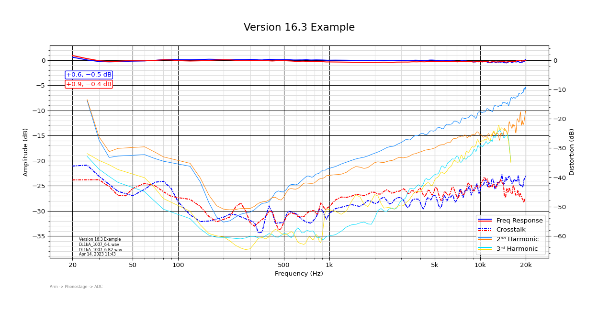

# SJPlot

## Overview
This python script was originally conceived by Scott Wurcer as a tool to accurately plot the frequency response of phono cartridges using the logarithmic sweep tracks found on common (and some not so common) test records.

## Features
- **Multiple Data Sets**: Frequency response, 2nd and 3rd harmonic distortion, and crosstalk. 
- **Mono or Stereo Files**: For stereo files, the Left channel is assumed to be the tone fundamental, and the Right channel the crosstalk. 
- **RIAA Processing**: Ability to apply RIAA bass and treble processing separately or together, along with inverse RIAA. 
- **STR-100 Support**: Correction for the constant velocity characteristic specific to the CBS STR-100 test record.
- **XG-7001 Support**: Correction of the custom bass EQ of this Denon test record.
- **Custom Normalization**: Ability to choose at which frequency to set the 0dB reference for the plot, and the ability to normalize both channels individually or to the same level as the first channel.
- **Custom Start/Stop points**: Choose to plot the entire sweep or to start at 1kHz, and/or the highest frequency to plot.
- **Multiple Plot Styles**: Choose between traditional, dual-axis, dual frequency response and distortion, dual frequency response zoom above dual axis, or a small plot of only frequency response.  

## Requirements
- Python 3
- NumPy
- SciPy
- Matplotlib
- Librosa

## Installation
1. Ensure Python 3 is installed on your system.
2. Install the required Python libraries using pip:

```bash
pip install numpy scipy matplotlib librosa
```

## Usage
1. After recording the test record sweep tracks, you need to create a file each for the left and right sweeps.  If you don't want to plot the crosstalk the file can be mono, otherwise the script expects the first channel of each file (Left) to be the sweep and the second channel (Right) to be the crosstalk.  The file cannot have any "silent" parts - it must begin at the beginning of the tone and end right when the tone stops.  The file should be in WAV format. 
2. Edit the SJPlot.py script file "#edit user parameters" section to include the wav filenames, information, and script settings.
3. Run the script to process the files.  A PNG image file of the plot will be created in the same directory as the script.

```bash
python3 SJPlot.py
```

Or, you can edit and run the script from IDLE which is typically a faster workflow. 

##Example Output##

<br/>
<div align="center" style="padding: 20px 0;">
    
    <p><b>Example dual-axis plot..</b></p>
</div>
<br/>


## How It Works
Usual FFT packages aren't the right tool to plot these sweep tracks. There are two primary issues: First, due to the test signal being a logarithmic sweep, the plot will have a 6dB/octave slope.  Second, any energy in the signal will be integrated in to the plot, including undesirable signals. The first issue can be solved by doing an RTA or fractional octave smoothing, the latter of which has consequences.  However, the second issue is more difficult to overcome as the test signal cannot be synchronized with the measurement.   

To solve for both issues, the script perfoms FFTs on sequential time-slices of the signal, taking the highest level at the desired measurement frequency (instantaneous frequency measurement).  Multiple measurements of the same frequency are averaged, and the plot data is thus created.  This method mirrors the behavior of the chart recorders for which these test tracks were intended. 


## Contributing
Contributions to improve the script are welcome. Please feel free to fork the repository, make your changes, and submit a pull request.

## License
This project is licensed under the MIT License - see the LICENSE file for details.


