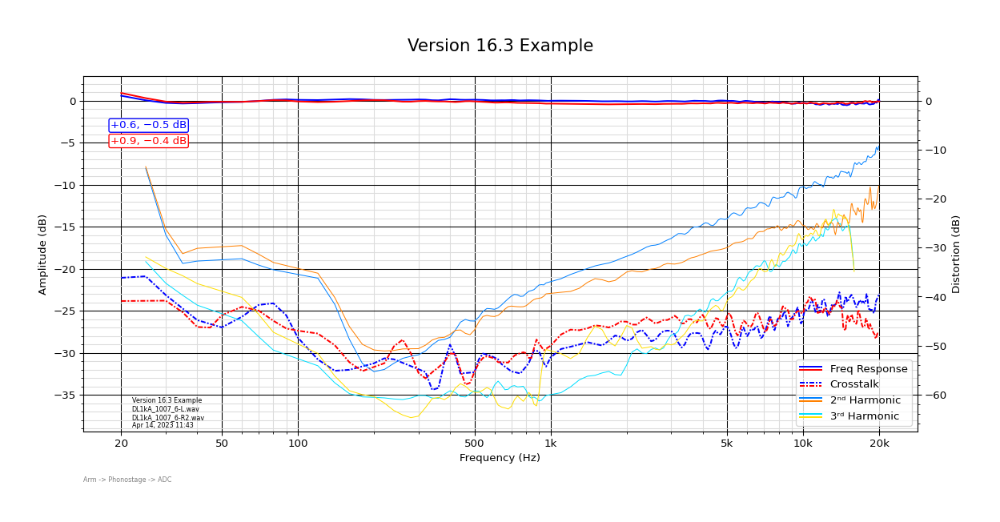

# SJPlot

## Overview
This python script was originally conceived by Scott Wurcer as a tool to accurately plot the frequency response of phono cartridges using the logarithmic sweep tracks found on common (and some not so common) test records.

## Features
- **Multiple Data Sets**: Frequency response, 2nd and 3rd harmonic distortion, and crosstalk. 
- **Mono or Stereo Files**: For stereo files, the Left channel is assumed to be the tone fundamental, and the Right channel the crosstalk. 
- **RIAA Processing**: Ability to apply RIAA bass and treble processing separately or together, along with inverse RIAA. 
- **STR-100 Support**: Correction for the constant velocity characteristic specific to the CBS STR-100 test record.
- **XG-7001 Support**: Correction of the custom bass EQ of this Denon test record.
- **Custom Normalization**: Ability to choose at which frequency to set the 0dB reference for the plot, and the ability to normalize both channels individually or to the same level as the first channel.
- **Custom Start/Stop points**: Choose to plot the entire sweep or to start at 1kHz, and/or the highest frequency to plot.
- **Multiple Plot Styles**: Choose between traditional, dual-axis, dual frequency response and distortion, dual frequency response zoom above dual axis, or a small plot of only frequency response.  

## Requirements
- Python 3
- NumPy
- SciPy
- Matplotlib
- Librosa

## Installation
1. Ensure Python 3 is installed on your system.
2. Install the required Python libraries using pip:

```bash
pip install numpy scipy matplotlib
```

## Usage
There are several options to provide the captured audio to the script:
  - If your sweep record is an STR-100, TRS-1007 (CA or JVC/Victor), or TRS-1005, you can provide a single stereo file that is from a few seconds before the first pilot tone, to a few seconds past the end of the second sweep, without any edits between.  The script can automatically extract the the sweeps from the file for processing.
  - You can manually process the audio and provide either one or two files to the script.  This audio file must not have any "silent" parts - it must begin at the start of the sweep and end when the sweep stops.  If you want to ploy the crosstalk these files must be stereo, otherwise they can be mono.
  - These files may be 16 or 24 bit wav and up to 96kHz sampling rate if you want to use the script's built-in RIAA filters.  If you don't need to use the built-in RIAA filters, they can be up to 384kHz.  

## Configuration

The script configuration may be provided by a configuration file (default: SJPlot.cfg) or via the command line. The configuration precedence works in the following order:

1. **Default values**: These are the built-in defaults, hardcoded into the script.
2. **Configuration file**: If you provide a configuration file, the values in that file will override the default values.
3. **Command-line arguments**: These take the highest precedence. If a command-line argument is provided, it will override both the default and the config file values.

For clarity, the configuraiton precdence is command line arguents first, then the configuration file values, and last the hard-coded default values.

| **Parameter**       | **Default** | **Description**                                                   |
|---------------------|-------------|-------------------------------------------------------------------|
| input_file_0     | |The first (L) file to plot, or the only file to plot, or the file you want to extract sweeps from. |
| input_file_1     | |The second (R) file to plot. If using one file, leave this blank. If you're extracting sweeps, this parameter is ignored. |
| plot_info        | |Alpha-numeric entries separated by " / ". The script will save a PNG file named from the plot_info argument, replacing " / " with "_". For example, "Cart / Load / Record" will create a file named "Cart_Load_Record.png". |
| equip_info       | |This argument is placed on the bottom left of the plot image to describe the capture chain. The recommended format is "Arm -> Phonostage -> ADC". |
| extract_sweeps   |`false`|<p>`false`: Do not process the file for extraction of sweeps.<br>`true`: Extract the sweeps from **INPUT_FILE_0**. |
| save_sweeps      |`false`|<p>`false`: Do not save files.<br>`true`: The extracted sweeps will be saved, appending either "_L" or "_R" to the **INPUT_FILE_0** filename for left and right sweeps, respectively. |
| test_record      | |If extracting sweeps, specify what test record the audio was captured from. Supported records are **STR100**, **TRS1007** (CA or JVC), and **TRS1005**. |
| plot_style       |4|<p>`1`: Traditional<br><p>`2`: Dual axis (twinx)<br><p>`3`: Dual plot FR and distortion<br><p>`4`: Dual plot FR zoom and dual axis (twinx)<br><p>`5`: Small plot FR only |
| file0norm        |`false`|<p>`false`: Normalize both files independently.<br>`true`: Normalize both files to file 0 level. |
| end_f            |20000|Highest frequency to plot in Hz.                                                |
| onekfstart       |`false`|<p>`false`: Disable,<br>`true`: Start plot from 1 kHz.                               |
| normalize        |1000|Frequency in Hz to set as 0dB in the plot.                                      |
| riaa_mode        |2|<p>`0`: Off<br><p>`1`: Bass emphasis<br><p>`2`: Treble de-emphasis,<br><p>`3`: Both               |
| riaa_inverse     |`true`|<p>`false`: Disable,<br>`true`: Inverse RIAA EQ per **riaa_mode** setting.            |
| str100           |`false`|<p>`false`: Disable,<br>`true`: Enable 6dB/oct correction from 500Hz to 40Hz.         |
| xg7001           |`false`|<p>`false`: Disable,<br>`true`: Custom bass filter for Denon XG-7001 sweep (stereoplay filter). |
| plot_data_out    |`false`|<p>`false`: Disable,<br>`true`: Output the plot data to the console.                  |
| log_level        |`info`|<p>`info`: Standard logging level,<br>`debug`: Verbose logging intended for debugging issues. |


```bash
python3 SJPlot.py
```

Or, you can edit and run the script from IDLE which is typically a faster workflow. 

## Example Output

<br/>
<div align="center" style="padding: 20px 0;">
    
    <p><b>Example dual-axis plot.</b></p>
</div>
<br/>


## How It Works
Usual FFT packages aren't the right tool to plot these sweep tracks. There are two primary issues: First, due to the test signal being a logarithmic sweep, the plot will have a 6dB/octave slope.  Second, any energy in the signal will be integrated in to the plot, including undesirable signals. The first issue can be solved by doing an RTA or fractional octave smoothing, the latter of which has consequences.  However, the second issue is more difficult to overcome as the test signal cannot be synchronized with the measurement.   

To solve for both issues, the script perfoms FFTs on sequential time-slices of the signal, taking the highest level at the desired measurement frequency (instantaneous frequency measurement).  Multiple measurements of the same frequency are averaged, and the plot data is thus created.  This method mirrors the behavior of the chart recorders for which these test tracks were intended. 


## Contributing
Contributions to improve the script are welcome. Please feel free to fork the repository, make your changes, and submit a pull request.

## License
This project is licensed under the MIT License - see the LICENSE file for details.


